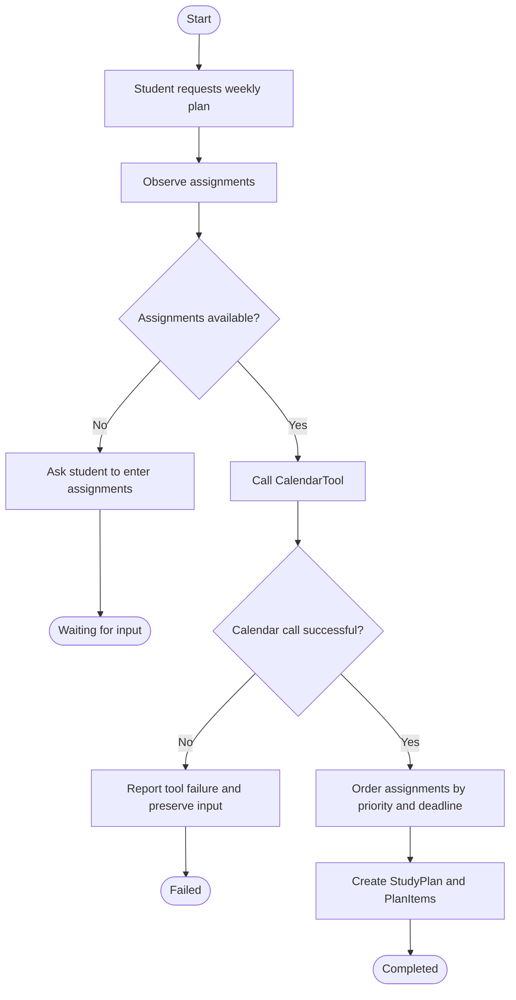

```mermaid
flowchart TD
    Start([Start]) --> Request[Student requests weekly plan]
    Request --> Observe[Observe assignments]
    Observe --> HasAssignments{Assignments available?}

    HasAssignments -- No --> Ask[Ask student to enter assignments]
    Ask --> Wait([Waiting for input])

    HasAssignments -- Yes --> Tool[Call CalendarTool]
    Tool --> ToolOK{Calendar call successful?}

    ToolOK -- No --> Fail[Report tool failure and preserve input]
    Fail --> Failed([Failed])

    ToolOK -- Yes --> Order[Order assignments by priority and deadline]
    Order --> Build[Create StudyPlan and PlanItems]
    Build --> Complete([Completed])
```
