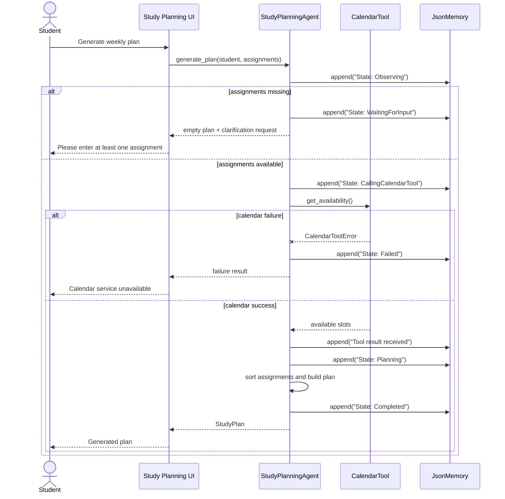

```mermaid
sequenceDiagram
    actor Student
    participant UI as Study Planning UI
    participant Agent as StudyPlanningAgent
    participant Calendar as CalendarTool
    participant Memory as JsonMemory

    Student->>UI: Generate weekly plan
    UI->>Agent: generate_plan(student, assignments)
    Agent->>Memory: append("State: Observing")

    alt assignments missing
        Agent->>Memory: append("State: WaitingForInput")
        Agent-->>UI: empty plan + clarification request
        UI-->>Student: Please enter at least one assignment
    else assignments available
        Agent->>Memory: append("State: CallingCalendarTool")
        Agent->>Calendar: get_availability()

        alt calendar failure
            Calendar--xAgent: CalendarToolError
            Agent->>Memory: append("State: Failed")
            Agent-->>UI: failure result
            UI-->>Student: Calendar service unavailable
        else calendar success
            Calendar-->>Agent: available slots
            Agent->>Memory: append("Tool result received")
            Agent->>Memory: append("State: Planning")
            Agent->>Agent: sort assignments and build plan
            Agent->>Memory: append("State: Completed")
            Agent-->>UI: StudyPlan
            UI-->>Student: Generated plan
        end
    end
```
