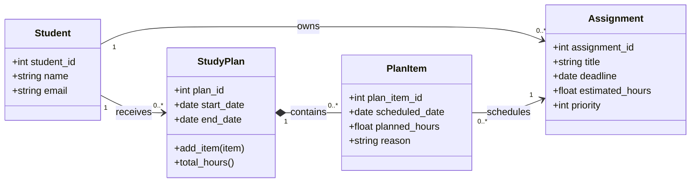

# Class Diagram

The following UML class diagram represents the main domain classes of the Study Planning Agent and their relationships.

The diagram shows that a student can own multiple assignments and receive multiple study plans. Each study plan contains multiple plan items, and each plan item schedules one assignment.
