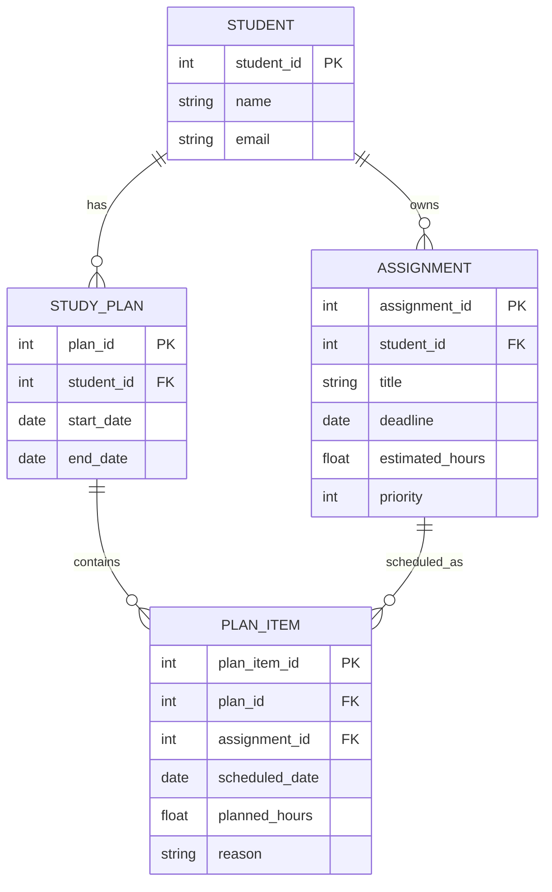

# Database Diagram

The following ER diagram represents the persistent data model of the Study Planning Agent, including entities, primary keys, foreign keys, and relationships.

The diagram shows that each student can own multiple assignments and multiple study plans. Each study plan contains multiple plan items, and each plan item is associated with one assignment.
