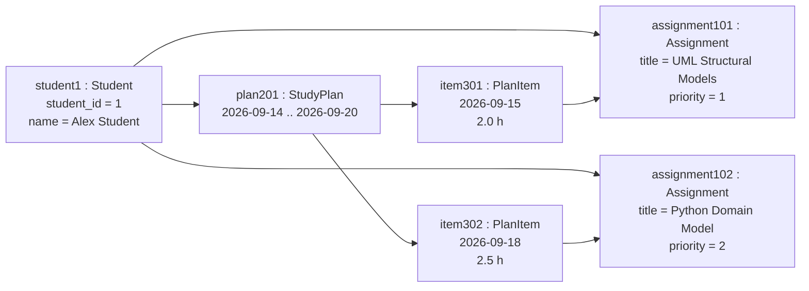

# Object Diagram

The following object diagram shows a concrete snapshot of the Study Planning Agent domain model using example runtime objects and values aligned with `app.py`.

The diagram illustrates one student with two assignments and one study plan. The study plan contains two plan items, each linked to a scheduled assignment.