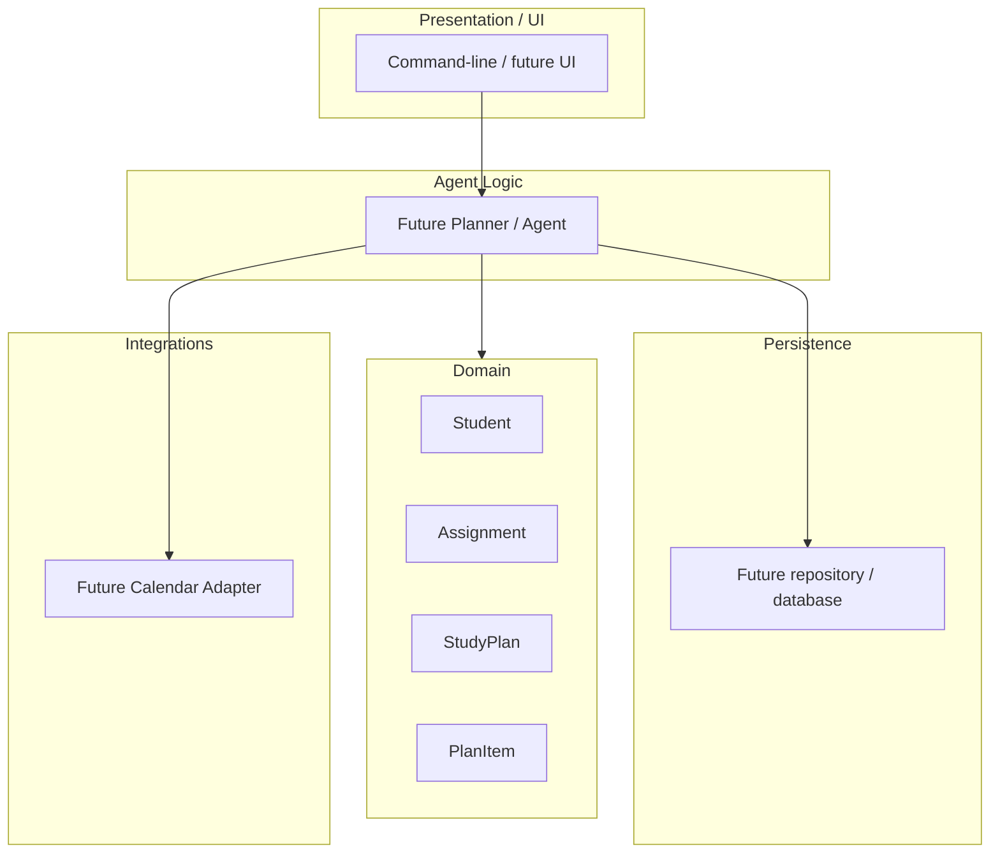

# Package Diagram

The following package-level diagram shows the logical organization of the Study Planning Agent and the dependencies between its main parts.

The diagram separates the application into presentation, domain, agent logic, persistence, and integration layers. The planner acts as the central application component, connecting the user interface with the domain model, persistence layer, and external integrations.